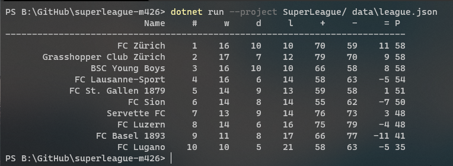

# Superleague project for the M426

*Feel free to get inspired but don't straight ahead copy everything and hand it in...*
## How to run?
``` dotnet run --project SuperLeague/ data\league.json ```

## How does it look

